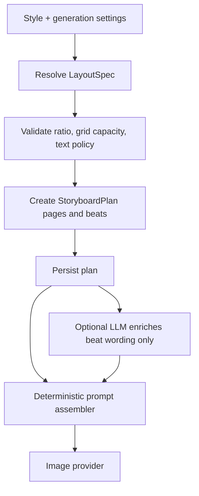

# Audit Gaya Layout Storyboard Storymax

**Cakupan:** katalog style, alias, parameter antarmuka, splitter konsep, builder prompt deterministik/LLM, dan render loop storyboard.  
**Metode:** penelaahan statis branch `master`. Audit ini belum membandingkan screenshot output proyek tertentu; karena itu temuan berfokus pada penyebab struktural yang paling mungkin membuat layout terasa aneh atau tidak menyerupai gaya yang dipilih.

## Kesimpulan

**Ya, ada masalah struktural pada sistem gaya layout.** Saat ini pilihan style sebagian besar mengatur **mood, kamera, pencahayaan, arc, dan negative prompt**, tetapi belum mengatur **geometri layout** secara tegas. Akibatnya, banyak style yang berbeda tetap jatuh ke instruksi generik: “grid sejumlah N panel pada satu sheet.” Model gambar kemudian harus menebak sendiri jumlah kolom, jumlah baris, orientasi panel, urutan baca, ukuran header, dan ruang teks. [1] [2]

> **Diagnosis utama:** Storymax saat ini lebih memiliki *style visual* daripada *layout contract*. Karena itu, style seperti B-Roll, UGC, Tutorial, Unboxing, Before–After, atau Product Hero dapat tampak terlalu mirip secara struktur poster walaupun mood visualnya berbeda.

| Area | Kondisi saat ini | Dampak ke hasil generate |
|---|---|---|
| Geometri panel | Sebagian besar style memakai fallback grid generik. | Panel dapat memiliki susunan, ukuran, dan urutan yang tidak stabil. |
| Rasio sheet | Rasio yang dipilih pengguna menimpa `format` pada style. | Style 16:9 atau 9:16 dapat dirender dalam sheet 1:1 tanpa peringatan. |
| Konsep per halaman | Splitter menghasilkan satu paragraf per halaman, bukan beat per panel. | Model gambar harus mengarang detail panel yang belum direncanakan. |
| Jumlah panel | `gridCount` tidak menjadi kontrak pada splitter eksplisit. | Jumlah panel dalam konsep dapat berbeda dari jumlah panel yang diperintahkan builder. |
| LLM vs fallback | Kedua jalur memakai layout hint yang sama, tetapi jalur LLM bebas menyusun prompt akhir. | Struktur layout dapat berubah tergantung jalur yang berhasil. |

## Bukti Utama

Katalog style backend memiliki **33** style, tetapi hanya **3** yang memiliki `layoutHint` spesifik: `kids_education`, `tiktok_text_ad`, dan `social_lifestyle`. Style lain menggunakan fallback `a grid of {N} numbered panels on one sheet`. Dengan kata lain, mayoritas style belum memiliki spesifikasi layout sheet yang eksplisit. [1] [2]

| Style ber-`layoutHint` | Kontrak visual yang saat ini lebih spesifik |
|---|---|
| `kids_education` | Kartu panel membulat, maskot kartun, ikon belajar, dan callout besar. |
| `tiktok_text_ad` | Panel bernomor dengan caption social-video besar dan time chip. |
| `social_lifestyle` | Panel foto vertikal seperti feed Instagram. |

Semua style lainnya, termasuk gaya yang secara konseptual sangat berbeda seperti Unboxing, Before–After, UGC Review, Tutorial, B-Roll, Product Hero, Anime, dan Cube Transform, tetap meminta grid umum tanpa aturan baris/kolom, arah baca, bentuk panel, atau tekstur sheet. [1] [2]

## Penyebab Hasil Storyboard Terasa Aneh

### P0 — Style tidak memiliki kontrak geometri layout

`styleLibrary` mendefinisikan `camera`, `lighting`, `header`, `arc`, dan `negatives`, tetapi hampir tidak memiliki informasi seperti `panelGrid`, `readingOrder`, `panelAspect`, `headerHeight`, atau `textPolicy`. Builder lalu mengubah kekosongan itu menjadi satu fallback grid generik. Ini membuat model gambar menafsirkan layout secara bebas; hasilnya dapat berupa panel tidak seragam, panel bertumpuk, jumlah panel salah, atau komposisi poster yang tidak selaras dengan nama style. [1] [2]

**Perbaikan P0:** tambahkan `layoutSpec` eksplisit ke setiap style. Contoh kontrak minimum:

```js
layoutSpec: {
  sheetRatio: '9:16',             // preferred output, bukan hanya format kosmetik
  ratioPolicy: 'lock',            // 'lock' | 'allow_override'
  panelGrid: { columns: 2, rows: 3, maxPanels: 6 },
  readingOrder: 'row_major',      // kiri→kanan, atas→bawah
  panelAspect: 'portrait',        // portrait | landscape | square | mixed
  frameStyle: 'hard_border',      // hard_border | comic_gutter | photo_strip
  headerMode: 'top_banner',       // top_banner | none | title_strip
  footerMode: 'production_strip',
  textPolicy: 'minimal_tags',     // none | minimal_tags | caption_required
  sceneDensity: 'one_action'      // exactly one visual action per panel
}
```

Contoh penerapan yang sesuai karakter style:

| Kelompok style | Grid yang dianjurkan | Catatan |
|---|---|---|
| `ugc_review`, `pov`, `tutorial_steps`, `recipe_cooking` | 2×3 pada sheet 9:16 | Urutan vertikal jelas, tiap panel satu aksi. |
| `cinematic_broll`, `short_story`, `product_hero` | 3×2 pada sheet 16:9 | Mengakomodasi shot lebar dan close-up. |
| `before_after`, `reaction` | 2×2 atau split pasangan | Perbandingan harus dipasangkan, bukan grid generik 6 panel. |
| `tiktok_text_ad` | 2×3 pada 9:16 | Caption besar wajib, bukan metadata kecil. |
| `social_lifestyle` | 2×3 foto vertikal | Tiap panel momen mandiri; jangan paksa kontinuitas lokasi. |
| `anime_comic` | 2×3 comic gutter | Frame komik dan urutan baca harus eksplisit. |
| `product_assembly`, transformasi | 2×3 timeline progresif | Panel 1 hingga akhir harus mengunci progres transformasi. |

### P0 — UI default menghasilkan konflik rasio dengan style default

Frontend dimulai dengan `style: 'premium_vertical_row'` dan `aspectRatio: '1:1'`. Namun `premium_vertical_row` adalah alias ke `cinematic_broll`, yang memiliki format `16:9`. Builder menggunakan `aspectRatio` dari UI bila ada, baru jatuh ke `spec.format` jika tidak ada. Karena itu, user dapat secara tidak sadar memilih B-Roll yang dimaksudkan landscape tetapi menerima sheet square 1:1. [1] [3] [4]

**Perbaikan P0:** saat style berubah, gunakan `layoutSpec.ratioPolicy`.

```js
const styleSpec = STYLE_CATALOG[style];
if (styleSpec.layoutSpec.ratioPolicy === 'lock') {
  setAspectRatio(styleSpec.layoutSpec.sheetRatio);
}
```

Jika produk harus tetap membolehkan override, tampilkan peringatan eksplisit: **“Style B-Roll direkomendasikan 16:9; 1:1 akan memakai struktur grid alternatif.”** Jangan membiarkan override tanpa mengubah `panelGrid`.

### P0 — Splitter tidak membentuk rencana panel yang sesuai `gridCount`

Splitter menerima `pageCount` dan `secondsPerPage`, tetapi tidak menerima `gridCount`. Ia menghasilkan satu string konsep untuk setiap halaman. Master prompt kemudian diperintahkan membuat enam panel (default), sambil menggabungkan `arc` style dan paragraf konsep. Tidak ada struktur yang menjamin setiap panel mendapat satu beat unik. [5] [6]

Pada jalur konsep yang sudah mengandung `Panel 1`, splitter membagi jumlah panel dengan `Math.ceil(panels.length / pageCount)` tanpa memeriksa `gridCount`. Misalnya konsep dengan jumlah panel yang tidak sama dengan `pageCount × gridCount` akan menghasilkan paket per halaman yang berbeda dari jumlah panel yang diminta builder. [5]

**Perbaikan P0:** gunakan `StoryboardPlan.pages[].beats[]` sebagai input tunggal. Validator harus memastikan:

1. `pages.length === pageCount`.
2. `beats.length === layoutSpec.panelGrid.maxPanels` atau batas grid yang dipilih.
3. Setiap beat memiliki `index`, `action`, `camera`, dan `visualAnchor`.
4. `readingOrder` menentukan posisi beat, bukan tebakan model gambar.
5. Builder dan splitter tidak pernah membuat ulang pembagian panel jika plan sudah tersedia.

### P1 — Sistem memaksa terlalu banyak teks pada poster kecil

Prompt memerintahkan header, badge durasi, nomor scene, judul scene, aksi satu baris, tag CAM/LIGHT, duration chip, dan opsional caption on-screen serta cue VO untuk **setiap** panel. Pada sheet square dengan enam panel, tuntutan teks ini bersaing dengan visual utama dan meningkatkan risiko teks garbled atau layout berantakan. [6] [7]

**Perbaikan P1:** pisahkan `textPolicy` per style dan density. Untuk grid 6 panel: gunakan nomor scene + satu tag kamera paling pendek. Hanya `tiktok_text_ad` yang boleh meminta caption besar. Jangan menggabungkan caption besar, VO cue, header penuh, production footer, dan enam panel pada sheet 1:1.

### P1 — Arc style dan splitter belum memakai kontrak yang sama

Style memiliki `arc` 4–5 beat, tetapi UI default meminta `gridCount = 6`. Builder mendistribusikan arc secara proporsional, sementara splitter membuat paragraf generik per halaman tanpa mengetahui arc style selain kasus transformasi tertentu. Hasilnya, satu panel dapat memuat beberapa tahap, atau panel tambahan menjadi repetitif. [1] [5] [6]

**Perbaikan P1:** turunkan beat dari `styleSpec.beatTemplate` yang memiliki panjang sesuai grid, atau lakukan expand secara terstruktur:

```js
beatTemplate: [
  { role: 'hook', camera: 'wide' },
  { role: 'context', camera: 'medium' },
  { role: 'action', camera: 'close_up' },
  { role: 'detail', camera: 'macro' },
  { role: 'proof', camera: 'medium' },
  { role: 'payoff', camera: 'hero' }
]
```

LLM hanya mengisi konten beat; ia tidak menentukan struktur/urutan grid.

### P1 — Ada konflik spesifik pada transformasi dan social lifestyle

Splitter memperlakukan `cube_box_transform`, `asmr_toy_transform`, dan `shape_morph_transform` sebagai kelompok yang harus dimulai tanpa tangan. Ini bertentangan dengan definisi `cube_box_transform`, yang meminta satu tangan menekan tombol dan melempar kubus pada beat pembuka. [1] [5]

Selain itu, system prompt LLM menginstruksikan semua style untuk menjaga background, palette, dan lighting identik antar panel, sementara `social_lifestyle` mengizinkan setting, wardrobe, aktivitas, dan pencahayaan berbeda pada tiap halaman. Instruksi bersaing ini dapat membuat style sosial tampak tidak konsisten atau terlalu seperti poster studio. [1] [7]

**Perbaikan P1:** gunakan `humanInteraction` dan `continuityPolicy` deklaratif di `layoutSpec`, lalu kirim field tersebut ke splitter, builder deterministik, dan LLM builder. Jangan mendeteksi kebijakan berdasarkan daftar style hard-coded.

### P2 — Jalur LLM dan deterministik belum memakai schema layout yang sama

Kedua jalur mendapat `layoutHint`, tetapi jalur LLM hanya diminta “membangun prompt final” dan hasilnya langsung dipotong hingga 1.950 karakter. Tidak ada validator yang memastikan instruksi panel grid, rasio, scene range, dan text policy tetap ada pada output LLM. Sementara itu, jalur deterministik menjamin baris struktur tetap ada. [6] [7]

**Perbaikan P2:** buat `buildLayoutContract(spec, ctx)` tunggal dan masukkan object ini secara verbatim ke kedua builder. Setelah LLM mengembalikan prompt, validasi token/marker struktural minimum atau gunakan builder deterministik sebagai assembler final.

## Flow Target



> Model gambar perlu menerima **layout contract yang sudah selesai**, bukan diminta sekaligus menjadi art director, grid designer, copywriter, storyboard artist, dan validator jumlah panel.

## Urutan Perbaikan yang Disarankan

| Prioritas | Perubahan | Hasil langsung |
|---:|---|---|
| **P0** | Tambahkan `layoutSpec` ke setiap style; tetapkan grid, reading order, panel aspect, dan policy rasio. | Setiap style benar-benar memiliki struktur layout berbeda. |
| **P0** | Selaraskan UI ratio dengan `layoutSpec`; berikan alternative grid bila override diizinkan. | Default B-Roll tidak lagi diam-diam menjadi sheet 1:1. |
| **P0** | Ganti splitter string dengan `StoryboardPlan.pages[].beats[]` berjumlah tepat sesuai grid. | Satu beat jelas untuk satu panel; tidak ada pembagian ulang ambigu. |
| **P1** | Batasi text policy berdasarkan density dan style. | Panel lebih terbaca; risiko garbled text berkurang. |
| **P1** | Satu policy deklaratif untuk human interaction dan continuity. | Cube, ASMR, dan social lifestyle tidak mendapat instruksi saling bertentangan. |
| **P2** | Normalisasi LLM builder agar hanya memperkaya prose, bukan mengubah kontrak layout. | Perilaku LLM dan fallback lebih konsisten. |

## Acceptance Criteria

| Skenario | Hasil wajib |
|---|---|
| Pilih `cinematic_broll` | UI menggunakan 16:9 atau menampilkan grid alternatif yang eksplisit bila user memilih rasio lain. |
| Pilih `before_after` | Sheet memakai pasangan before/after yang sinkron, bukan enam panel generik. |
| Pilih `social_lifestyle`, 2 halaman | Masing-masing halaman memuat momen mandiri; identitas karakter konsisten, tetapi setting tidak dipaksa sama. |
| Pilih `cube_box_transform` | Panel pembuka mengizinkan satu tangan sesuai policy; panel lanjutan otomatis/hands-free. |
| `gridCount = 6` | Plan berisi persis enam beat unik per halaman; builder menerima enam panel dengan urutan baca jelas. |
| Caption + VO aktif pada grid 6 | Style policy memilih salah satu atau mereduksi metadata, sehingga tidak ada tuntutan teks berlebih. |
| LLM builder gagal | Fallback menghasilkan layout contract yang sama, termasuk grid, ratio, dan text policy. |

## References

[1]: https://github.com/curls1337/storymax/blob/master/backend/prompts/styleLibrary.js "Style definitions, layout hints, and aliases"
[2]: https://github.com/curls1337/storymax/blob/master/backend/prompts/masterPrompt.js#L208-L285 "Deterministic layout and panel prompt assembly"
[3]: https://github.com/curls1337/storymax/blob/master/frontend/src/pages/Generator.jsx#L50-L65 "Generator default style and aspect ratio"
[4]: https://github.com/curls1337/storymax/blob/master/backend/prompts/styleLibrary.js#L325-L360 "Legacy style aliases and resolution"
[5]: https://github.com/curls1337/storymax/blob/master/backend/prompts/splitPrompt.js "Page splitter and explicit panel slicing"
[6]: https://github.com/curls1337/storymax/blob/master/backend/jobs/storyboardJobs.js#L316-L370 "Storyboard render loop"
[7]: https://github.com/curls1337/storymax/blob/master/backend/prompts/masterPromptLLM.js "LLM master prompt builder"
