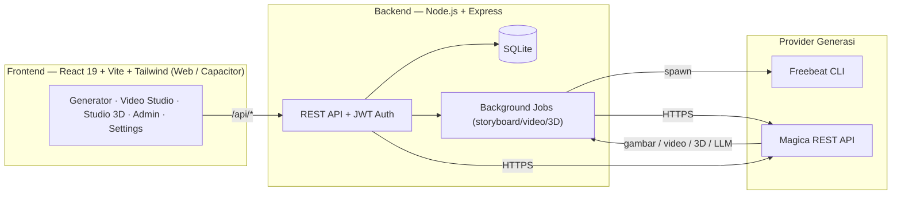

<div align="center">


# 🎬 StoryMax

**Generator AI untuk Storyboard, Video, dan Model 3D — dalam satu workspace.**


[🌐 Live Demo](https://story.devcurl.me) · [✨ Fitur](#-fitur) · [🚀 Mulai Cepat](#-mulai-cepat-local) · [⚙️ Konfigurasi](#️-konfigurasi-admin) · [📖 Cara Pakai](#-cara-pakai)

</div>

---

## 📌 Tentang

**StoryMax** adalah aplikasi web (sekaligus app iOS/Android via Capacitor) untuk membuat:
1. **Storyboard** — satu lembar berisi grid panel bernomor dari sebuah ide/produk.
2. **Video** — dari panel storyboard (Image-to-Video) atau dari teks (Text-to-Video).
3. **Model 3D** — dari teks atau gambar (Text/Image-to-3D), bisa diputar & dianimasikan.

Mendukung **dua provider** generasi: **Freebeat** (asli) dan **Magica** (REST API) — dengan
pemilihan provider oleh admin/user, aturan kredit, estimasi biaya sebelum generate, dan
penanganan error yang jelas.

<div align="center">

<br/><sub>Halaman login — tema gelap + aksen emas.</sub>
</div>

---

## 📖 Daftar Isi
- [Fitur](#-fitur)
- [Arsitektur](#-arsitektur)
- [Alur Generasi](#-alur-generasi)
- [Tech Stack](#-tech-stack)
- [Struktur Proyek](#-struktur-proyek)
- [Mulai Cepat (Local)](#-mulai-cepat-local)
- [Environment Variables](#-environment-variables)
- [Deploy (Railway)](#-deploy-railway)
- [Konfigurasi Admin](#️-konfigurasi-admin)
- [Cara Pakai](#-cara-pakai)
- [Sistem Kredit & Estimasi](#-sistem-kredit--estimasi)
- [API Reference](#-api-reference-ringkas)
- [Skema Database](#-skema-database)
- [Troubleshooting](#-troubleshooting)
- [Catatan Developer](#-catatan-developer)

---

## ✨ Fitur

| Kategori | Detail |
|---|---|
| 📋 **Storyboard** | 30+ gaya layout, grid panel bernomor, multi-halaman, referensi produk (konsistensi subjek), mode wajah (faceless/full). |
| 🎞️ **Video** | Image-to-Video / Text-to-Video / Reference-to-Video; voiceover & backsound opsional; prompt kamera-only untuk I2V (anti-crop, anti-grid). |
| 🧊 **3D (Meshy V6)** | Text-to-3D & Image-to-3D; preview `<model-viewer>` (putar + animasi); setting lengkap (polycount, topology, symmetry, PBR, rigging, dll); history bisa diklik. |
| 🔀 **Multi-provider** | Freebeat & Magica untuk gambar/video; Magica untuk LLM & 3D. Admin memberi izin, user memilih di Pengaturan. |
| 🧠 **LLM** | Prompt engineering via LLM (fallback deterministik). Bisa pakai model LLM Magica (key acak) — dipilih admin. |
| 💰 **Kredit** | Estimasi biaya **sebelum** generate, kredit terpakai per item, aturan key (≥5 kredit untuk media), cek biaya pra-terbang (gagal cepat kalau saldo kurang). |
| 🔔 **UX** | Notifikasi toast/confirm on-brand, mobile-friendly (safe-area, keyboard, pull-to-refresh), error Magica ditampilkan jelas. |
| 🛠️ **Admin** | Kelola API key (Freebeat & Magica) + Tes Koneksi, izin Magica per-user, pengaturan LLM, **Backup & Restore** database. |

---

## 🏗 Arsitektur



---

## 🔁 Alur Generasi

```mermaid
flowchart TD
  A["User submit (ide/prompt/gambar)"] --> B{"preferred_provider?"}
  B -->|Freebeat| C["Freebeat CLI (spawn)"]
  B -->|Magica| D{"Jenis job?"}
  D -->|Gambar / Video / 3D| E{"Ada key Magica ≥ 5 kredit?"}
  E -->|Tidak| X["❌ Error jelas: key < 5 kredit = LLM saja / top up"]
  E -->|Ya| F["Pre-flight estimasi biaya vs saldo"]
  F -->|Saldo kurang| X
  F -->|Cukup| G["POST /nodes/{model}/run → poll → hasil URL"]
  D -->|LLM (teks)| H["Key acak (utamakan < 5 kredit) → chat"]
  C --> Z["Simpan hasil + kredit terpakai"]
  G --> Z
  H --> Z
```

---

## 🧰 Tech Stack

- **Frontend:** React 19, Vite, Tailwind CSS 4, Capacitor (iOS/Android), lucide-react, `<model-viewer>` (3D).
- **Backend:** Node.js, Express, SQLite (`sqlite` + `sqlite3`), JWT.
- **AI Providers:** Freebeat (via `freebeat-cli`), Magica REST API (gambar, video, LLM, 3D/Meshy V6).
- **Deploy:** Railway (auto-deploy dari `master`).

---

## 📂 Struktur Proyek

```
storymax/
├─ backend/
│  ├─ server.js                 # entry Express, mount routes
│  ├─ db.js                     # SQLite init + migrasi (semua CREATE TABLE)
│  ├─ config/                   # secrets, path uploads
│  ├─ controllers/
│  │  ├─ aiController.js         # prompt video (I2V/T2V) + vision analisa lembar
│  │  ├─ storyboardController.js # generate storyboard
│  │  ├─ videoController.js      # generate video (single + all) + marketing copy
│  │  ├─ adminController.js      # kelola key, ai-settings, backup/restore, izin user
│  │  └─ authController.js
│  ├─ jobs/storyboardJobs.js     # render tiap halaman storyboard (background)
│  ├─ prompts/
│  │  ├─ aiClient.js             # router LLM (default / Magica) + shim
│  │  ├─ masterPromptLLM.js      # prompt via LLM (fallback ke masterPrompt.js)
│  │  ├─ styleLibrary.js         # 30+ gaya layout
│  │  ├─ splitPrompt.js · subjectAnalyzer.js · ...
│  ├─ services/
│  │  ├─ magicaClient.js         # REST client Magica
│  │  ├─ magicaGen.js            # semua logika Magica (key, schema, generate, estimate)
│  │  └─ freebeat/cli.js
│  └─ routes/                    # authRoutes, storyboardRoutes, videoRoutes, adminRoutes, magicaRoutes
├─ frontend/
│  ├─ index.html                 # + CDN <model-viewer>
│  └─ src/
│     ├─ App.jsx                 # layout + tab (dashboard|generator|3d|settings|admin)
│     ├─ pages/                  # Generator, Dashboard, ThreeD, Settings, AdminPanel, Login
│     ├─ components/             # ToastHost, ConfirmHost
│     └─ utils/                  # api.js, toast.js, confirm.js
└─ README.md
```

---

## 🚀 Mulai Cepat (Local)

> Prasyarat: **Node.js 18+** dan npm.

```bash
# 1) Clone
git clone https://github.com/curls1337/storymax.git
cd storymax

# 2) Backend
cd backend
npm install
cp .env.example .env   # lalu isi (lihat Environment Variables)
npm run start          # atau: node server.js

# 3) Frontend (terminal baru)
cd ../frontend
npm install
npm run dev            # Vite dev server
# build produksi: npm run build  (hasil di dist/)
```

Backend melayani API di `/api/*`; frontend (Vite) proxy ke backend saat dev. Untuk produksi,
frontend di-build lalu di-serve (atau via hosting statis) dan menunjuk ke URL backend.

---

## 🔑 Environment Variables

Buat `backend/.env`:

```env
# Auth
JWT_SECRET=ganti_dengan_string_acak_panjang

# LLM default (OpenAI-compatible) — dipakai kalau provider LLM = default & untuk vision
AI_API_HOST=https://endpoint-openai-compatible/v1
AI_API_TOKEN=xxxxx
AI_MODEL=gemini-3-flash

# WAJIB untuk fitur berbasis gambar-referensi Magica (image-to-image / image-to-video / image-to-3D)
# Magica butuh URL PUBLIK untuk mengambil gambar (base64 tidak diterima).
PUBLIC_URL=https://story.devcurl.me
```

> API key Freebeat & Magica **tidak** ditaruh di `.env` — dikelola lewat **Panel Admin**
> (disimpan di database), sehingga bisa ganti/tambah tanpa deploy ulang.

---

## ☁️ Deploy (Railway)

- Repo terhubung ke Railway; **push/merge ke `master` → auto-deploy**.
- Set env `PUBLIC_URL` (dan variabel lain) di Railway → Variables.
- Jika build baru **tidak muncul**: Railway → **Deployments → "Deploy latest commit"**.
- App native (Capacitor) memuat URL remote, jadi setiap deploy web otomatis meng-update app.

---

## ⚙️ Konfigurasi Admin

Login sebagai **admin** → menu **Panel Admin**:

1. **API Freebeat** — tambah key pool Freebeat.
2. **API Magica** — tambah key Magica (dari https://app.magica.com → Settings → API Keys),
   klik **Tes Koneksi** (cek saldo + jumlah model). Key `gx_...`.
3. **Pengaturan AI** — pilih **Provider LLM** (Default / Magica) + **Model LLM Magica**
   (gpt_5_5 / claude / gemini / dll). Isi juga Endpoint + API Key default (dipakai untuk vision).
4. **Manajemen User** — beri izin **Magica** per-user (untuk gambar/video/LLM). *(3D terbuka untuk semua user.)*
5. **Backup / Restore** — export/import seluruh tabel DB (link + settings) sebagai JSON.

Lalu tiap **user** memilih provider di **Pengaturan** (Freebeat / Magica).

---

## 📚 Cara Pakai

### 1) Storyboard (AI Generator)
1. Masuk tab **AI Generator**.
2. Pilih **gaya layout**, jumlah grid, model, ukuran, (opsional) unggah **gambar referensi produk**.
3. (Magica) pilih **API Key** & lihat **estimasi biaya**.
4. Klik **Generate** → tunggu proses → hasil muncul di Dashboard.

### 2) Video (Video Studio di Dashboard)
1. Buka storyboard → **Video Studio**.
2. Pilih **Metode** (I2V/T2V/Reference), **Model**, **Durasi/Resolusi/Rasio** (mengikuti model Magica).
3. Lihat **estimasi biaya**, atur audio/backsound → **Buat Video** (atau **Buat Semua**).

### 3) Studio 3D (Meshy V6)
1. Buka tab **Studio 3D**.
2. Pilih **Text → 3D** atau **Image → 3D**, pilih **API Key**, atur setting Meshy.
3. Lihat estimasi → **Buat 3D**. Hasil tampil di **preview besar** (bisa diputar & animasi);
   **history** di bawah bisa diklik untuk pratinjau ulang; unduh `.glb`.

---

## 💰 Sistem Kredit & Estimasi

- **Estimasi sebelum generate**: setiap gambar/video/3D menampilkan perkiraan biaya (kredit).
- **Kredit terpakai** tampil per storyboard & per video.
- **Aturan key Magica**: key dengan saldo **< 5 kredit** hanya dipakai untuk **LLM**; gambar/video/3D
  memakai key **≥ 5 kredit** (otomatis pilih saldo tertinggi).
- **Pre-flight**: sebelum video/3D, biaya dicek vs saldo → **gagal cepat** dengan pesan jelas kalau kurang
  (bukan menunggu lama lalu error).
- **Kredit Magica bersifat per-akun** — untuk menambah saldo tanpa top up, tambahkan key dari **akun Magica lain**.

| Job | Estimasi biaya (acuan) |
|---|---|
| Gambar (gpt_image_2) | ~0.21 kredit |
| Video seedance-fast 15s / 720p | ~3.63 kredit |
| Video seedance 15s / 1080p | ~10.2 kredit |
| 3D (Meshy preview) | ~0.6–0.8 kredit |
| LLM (per panggilan) | ~0.0001 kredit |

---

## 🔌 API Reference (ringkas)

Semua di bawah `/api`, butuh header `Authorization: Bearer <JWT>`.

| Method | Endpoint | Fungsi |
|---|---|---|
| POST | `/auth/login` · `/auth/register` | Auth |
| GET/PUT | `/auth/me` · `/auth/preferred-provider` | Profil + pilih provider |
| POST | `/storyboards/generate` | Buat storyboard |
| GET | `/storyboards/tasks/:taskId` | Status task storyboard |
| POST | `/videos/generate` · `/videos/generate-all` | Buat video |
| GET | `/videos/storyboard/:id` | Daftar video |
| GET | `/magica/catalog` | Key + model (image/video/llm) + metode |
| GET | `/magica/keys` | Daftar key aktif + saldo |
| POST | `/magica/estimate` | Estimasi biaya `{kind:image\|video\|3d, ...}` |
| POST | `/magica/3d/generate` | Buat 3D (background) |
| GET | `/magica/3d/task/:id` · `/magica/3d/list` | Status & riwayat 3D |
| * | `/admin/*` | Kelola key, ai-settings, izin user, backup/restore (admin) |

**Magica REST** (dipakai backend): base `https://api.magica.com/api/v1`, auth `Bearer gx_...`;
`POST /nodes/{nodeType}/run {subModelId,input}` → poll `GET /nodes/runs/{runId}`;
biaya `POST /nodes/estimate-credits`; skema `GET /models/{id}/schema`.

---

## 🗄 Skema Database

Tabel utama (SQLite): `users` (+`can_use_magica`, `preferred_provider`), `api_keys` (Freebeat),
`magica_api_keys`, `ai_settings` (endpoint, api_key, model, `llm_provider`, `magica_llm_model`),
`storyboards`, `generated_videos`, `generated_3d`, `google_settings`, `downloaded_files`.

Migrasi memakai pola aman: `ALTER TABLE ... ADD COLUMN` dibungkus `try/catch` di `db.js`.

---

## 🩺 Troubleshooting

| Masalah | Penyebab & Solusi |
|---|---|
| **"Insufficient credits" / kredit kurang** | Saldo key Magica < biaya job. Top up, atau tambah key dari akun lain, atau turunkan durasi/resolusi. |
| **Gambar/video Magica tak jalan padahal ada key** | Key < 5 kredit (khusus LLM). Pakai/isi key ≥ 5 kredit. |
| **Image-to-image / image-to-video / image-to-3D gagal ambil gambar** | `PUBLIC_URL` belum di-set di server (Magica butuh URL publik, bukan base64). |
| **Build baru tak muncul** | Railway → Deployments → **Deploy latest commit**. |
| **Video lama sekali lalu gagal** | Render berat/batch banyak; sudah ada pre-flight + timeout 25 menit. Pakai preview/resolusi lebih rendah. |
| **Kenapa gagal?** | Lihat pesan error Magica: Generator (banner merah), Video Studio (panel merah), 3D (panel preview merah). |

---

## 👩‍💻 Catatan Developer

- **Alur kontribusi:** buat branch dari `master` → ubah → verifikasi → **Pull Request** → merge (squash) → auto-deploy.
- **Verifikasi cepat:** backend `node -c file.js`; frontend cek keseimbangan `{}` / `()` / `<div>` / `<>` dan
  pastikan `useEffect`/`useMemo` **tidak** merujuk state yang dideklarasikan setelahnya (hindari TDZ → layar blank).
- **Jangan sentuh jalur Freebeat** saat menambah fitur Magica (cabang Magica dibuat terpisah, risiko nol).
- **Keamanan:** jangan commit API key. Key `gx_` dikelola lewat Panel Admin (DB), bukan di kode.

---

<div align="center">
<sub>StoryMax · dibuat dengan ❤️ untuk kreator. Live: <a href="https://story.devcurl.me">story.devcurl.me</a></sub>
</div>
