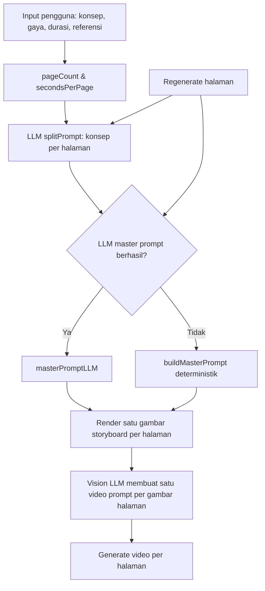
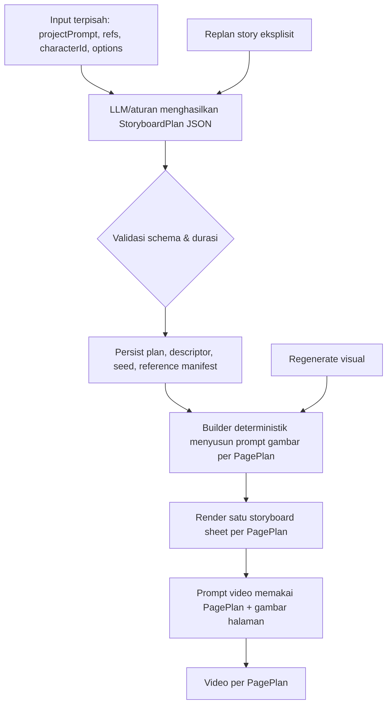

# Audit Master Prompt dan Flow Storymax

**Repositori:** [`curls1337/storymax`](https://github.com/curls1337/storymax)  
**Cakupan audit:** `masterPrompt`, pemecahan konsep per halaman, pekerjaan render storyboard, generator prompt video, regenerasi halaman, serta penyimpanan `video_prompts`.  
**Metode:** penelaahan statis terhadap branch `master`; audit ini belum mencakup pengujian runtime dengan API key, output provider gambar/video, maupun contoh proyek pengguna.

## Kesimpulan Eksekutif

**Belum sepenuhnya benar.** Arsitektur Storymax sudah memiliki fondasi yang baik: terdapat pemecahan konsep per halaman, fallback ketika LLM gagal, pemakaian referensi untuk menjaga identitas, dan alur render latar belakang. Namun, perilaku akhir masih dapat sangat berbeda karena **satu proyek melewati beberapa kontrak prompt yang tidak identik**, lalu sebagian state penting dihitung ulang ketika regenerasi. Akibatnya, storyboard, prompt video, voice-over, dan video akhir tidak selalu memakai sumber kebenaran yang sama. [1] [2] [3]

| Area | Penilaian | Ringkasan |
|---|---:|---|
| Master prompt storyboard | **Perlu perbaikan prioritas tinggi** | Jalur LLM dan jalur deterministik menghasilkan kontrak durasi dan kontinuitas yang berbeda. |
| Aturan gaya transformasi/ASMR | **Tidak konsisten** | Ada konflik eksplisit tentang boleh atau tidaknya tangan/manusia. |
| Regenerasi halaman | **Tidak deterministik** | Konsep halaman dan descriptor dapat dibuat ulang, sehingga hasil regenerasi berpotensi berbeda dari proyek awal. |
| Prompt video | **Rentan tidak sinkron** | Prompt video dipetakan per halaman, tetapi ada mutasi schema yang dapat menghapus prompt visual tersimpan. |
| Fondasi teknis | **Cukup baik** | Pemisahan modul, fallback builder, dan penyimpanan proses latar belakang sudah merupakan arah yang tepat. |

> **Diagnosis utama:** masalahnya bukan hanya “kalimat master prompt kurang kuat”, melainkan **flow data dan kepemilikan state**. Memperpanjang prompt tanpa menyatukan kontrak data kemungkinan justru menambah konflik instruksi.

## Flow yang Berjalan Saat Ini

Secara aktual, pengguna mengirim konsep, parameter gaya, durasi, referensi, dan opsi VO. Sistem menentukan jumlah halaman dari durasi dan engine video, lalu LLM membagi konsep menjadi `pageCount` konsep halaman. Untuk setiap halaman, sistem memilih **LLM master prompt terlebih dahulu**; jika gagal, baru menggunakan builder deterministik. Hasil gambar tiap halaman kemudian disimpan dan satu prompt video dibuat untuk setiap **gambar halaman**, bukan untuk setiap panel di dalam grid. [3] [4]

| Konsep data | Implementasi saat ini | Dampak praktis |
|---|---|---|
| **Halaman** | Satu gambar poster storyboard berisi banyak panel grid. | Satu halaman bukan satu panel individual. |
| **Video scene** | `totalScenes = panelImages.length`; artinya satu video prompt/video per gambar halaman. | Istilah “scene” sebenarnya dipakai sebagai “halaman/segmen video”. |
| **Panel dalam grid** | Beat visual di dalam satu gambar halaman. | Tidak memiliki record/prompt video individual. |
| **Durasi** | Dihitung sebagai durasi per halaman di builder deterministik, tetapi LLM master prompt membawa total durasi proyek. | Dua jalur memberi instruksi waktu yang berlainan. |

Model ini boleh dipakai apabila produk yang dimaksud adalah **satu video kontinu per halaman storyboard**. Namun model tersebut harus dinyatakan secara tegas sebagai `pageSegment`, bukan “scene/panel”, agar seluruh modul memakai pemetaan yang sama. Bila produk yang diinginkan adalah **satu video untuk setiap panel grid**, model data dan aset perlu diubah: gambar harus dipotong/crop per panel dan `video_prompts` harus berindeks panel, bukan halaman. [3] [4]

## Temuan Prioritas Kritis

### 1. Dua jalur master prompt memakai kontrak waktu yang berbeda

Builder deterministik menghitung durasi per halaman, jendela waktu absolut, nomor halaman, serta instruksi lanjut/tidak lanjut antarhalaman. Sebaliknya, `masterPromptLLM` menerima `totalDuration` sebagai `PARAMS.duration`, tidak menerima `secondsPerPage`, dan tidak mengirim jendela waktu ke LLM. Jalur LLM ini dipanggil lebih dahulu pada render awal dan regenerasi. Dengan proyek 30 detik yang dibagi menjadi dua halaman, builder deterministik dapat mendeskripsikan tiap halaman sebagai 15 detik, sedangkan jalur LLM masih diperintahkan memakai 30 detik pada setiap halaman. [1] [2] [3]

| Risiko | Gejala yang mungkin terlihat | Perbaikan yang disarankan |
|---|---|---|
| Durasi per halaman salah | Badge storyboard, pacing beat, dan VO/video tidak selaras antarhalaman. | Bentuk satu `PagePlan` kanonik dengan `segmentDuration`, `timeStart`, `timeEnd`, `pageIndex`, dan `pageCount`; kirim objek yang sama ke seluruh builder. |
| Kontinuitas tidak konsisten | Halaman kedua mengulang hook atau tidak terasa lanjutan. | Hilangkan duplikasi logika kontinuitas antara splitter, LLM master prompt, dan builder; `PagePlan.continuity` harus menjadi satu-satunya sumber. |
| Output berubah tergantung provider LLM | Hasil pada kondisi LLM aktif berbeda jauh dengan saat fallback. | Untuk perbaikan cepat, jadikan `buildMasterPrompt` sebagai satu-satunya assembler produksi dan gunakan LLM hanya untuk menghasilkan data `PagePlan` terstruktur yang tervalidasi. |

### 2. Kebijakan tangan/manusia saling bertentangan pada beberapa style

`normalizeFaceMode` memaksa `no_people` untuk style yang namanya mengandung `cube`, `asmr`, `shape_morph`, atau `capsule`. Aturan ini membuat master prompt menambahkan larangan tangan/manusia. Namun, style `cube_box_transform` secara eksplisit membutuhkan satu tangan untuk menekan tombol dan melempar kubus. Style `mini_restoration_asmr` membutuhkan tangan dan alat presisi, sedangkan `jelly_character_asmr` membutuhkan telapak tangan. Pada tahap video, aturan cube juga kembali berkonflik: satu blok meminta tangan untuk pembukaan, blok generik melarang tangan untuk transformasi, dan sanitasi pascaproses mengganti semua penyebutan tangan dengan “mechanical panels”. [5] [6] [7]

| Style | Instruksi yang benar menurut desain style | Instruksi yang kini berbenturan | Keputusan kebijakan yang diperlukan |
|---|---|---|---|
| `cube_box_transform` | Satu tangan menekan tombol dan melempar, lalu keluar frame. | `no_people`; larangan tangan; sanitasi menghapus tangan dari prompt video. | `brief_opening_hand` — tangan hanya pada beat pembuka. |
| `asmr_toy_transform` | Tidak ada manusia atau tangan. | Sejalan dengan `no_people`. | `forbidden`. |
| `shape_morph_transform` | Tidak ada manusia atau tangan. | Sejalan dengan `no_people`. | `forbidden`. |
| `mini_restoration_asmr` | Tangan dan alat presisi wajib terlihat. | Nama mengandung `asmr`, sehingga dipaksa `no_people`. | `required_hands`. |
| `jelly_character_asmr` | Figur berada di telapak tangan. | Nama mengandung `asmr`, sehingga dipaksa `no_people`. | `required_palm`. |

Perbaikannya bukan menambah negative prompt. Buat properti eksplisit di `styleLibrary`, misalnya `humanInteraction: 'forbidden' | 'opening_only' | 'required_hands' | 'required_palm'`, lalu turunkan aturan gambar, I2V, T2V, dan sanitasi dari properti itu. Jangan gunakan pencarian substring nama style sebagai dasar kebijakan visual.

### 3. Schema `video_prompts` dapat rusak saat regenerasi marketing copy

Generator prompt video menyimpan data dalam object berbentuk `{ "scenes": [...] }`. Akan tetapi, `regenerateStoryboardMarketingCopy` hanya menerima array; ketika mendapat object tersebut, ia menggantinya dengan array kosong lalu menyimpan array baru yang hanya memiliki `marketing_title` dan `marketing_description`. Sementara `generateAllVideos` hanya membaca `parsed.scenes`, sehingga setelah mutasi ini prompt visual per halaman bisa tidak ditemukan dan proses turun ke fallback `storyboard.prompt` untuk semua video. [4] [8]

> Ini adalah bug data-flow, bukan masalah kualitas LLM. Ia dapat menyebabkan video memakai prompt utama yang generik meskipun storyboard sebelumnya sudah memiliki prompt I2V/T2V yang spesifik.

Perbaikan prioritasnya adalah menetapkan schema stabil, misalnya `{ version: 1, scenes: [...], marketing: {...} }`. Marketing copy idealnya disimpan di kolom yang memang sudah tersedia (`marketing_title`, `marketing_description`) dan **tidak pernah menimpa** `video_prompts`. Tambahkan migrasi pembaca untuk schema lama agar data proyek yang sudah ada tetap dapat dipakai.

## Temuan Prioritas Tinggi

### 4. Regenerasi halaman membuat ulang keputusan kreatif dan tidak menyegarkan prompt video

Ketika pengguna meregenerasi halaman, sistem memanggil ulang `splitStoryboardPromptWithAI`, menghitung ulang `subjectDescriptor`, dan dapat menganalisis ulang descriptor karakter. Nilai hasil awal tersebut tidak dipersisten di `generation_params`. Karena pemecahan konsep memakai LLM, halaman yang diregenerasi dapat memperoleh konsep yang berbeda walaupun input pengguna tidak berubah. Setelah gambar baru tersimpan, `video_prompts` untuk halaman tersebut tidak dibuat ulang atau ditandai stale. [3] [9]

| Kondisi | Risiko saat ini | Perilaku yang seharusnya |
|---|---|---|
| Regenerate halaman 2 | Halaman 2 dapat berganti beat, detail subjek, atau anchor karakter. | Gunakan kembali `StoryboardPlan.pages[1]`, descriptor subjek, descriptor karakter, dan referensi persis dari generasi awal. |
| Gambar halaman berubah | I2V/T2V lama masih mendeskripsikan gambar sebelumnya. | Hapus/tandai `video_prompts.scenes[pageIdx]` sebagai stale lalu generate ulang hanya segmen tersebut. |
| Pengguna memang ingin konsep baru | Tidak ada mode eksplisit untuk mengubah plan. | Sediakan dua aksi berbeda: **Regenerate visual** dan **Replan story**. |

### 5. Deskripsi karakter disuntikkan ke konsep utama meskipun backend berusaha mencegah kebocoran teks

Frontend menambahkan `[Character Appearance & Outfit: ...]` dari `trigger_prompt` ke `prompt` sebelum request dibuat. Prompt itu lalu dipakai oleh splitter dan subject analyzer. Di sisi lain, job storyboard menyatakan bahwa data karakter sengaja tidak dimasukkan sebagai teks karena pernah bocor menjadi teks pada panel. Kedua pendekatan ini bertentangan dan dapat membuat bracket, nama, atau descriptor karakter masuk kembali ke konsep visual/per-panel. [3] [10]

Gunakan field terpisah: `projectPrompt`, `characterId`, `characterDescriptor`, dan `characterReference`. Jangan pernah menggabungkan descriptor karakter ke `projectPrompt`. Prompt final boleh memuat `characterDescriptor` sebagai anchor visual, tetapi harus berasal dari object kanonik dan tidak dicampur dengan copy bebas pengguna.

### 6. Storyboard memaksa terlalu banyak teks sebagai sumber instruksi video

Master prompt meminta header, badge durasi, nomor scene, judul scene, aksi satu baris, tag CAM/LIGHT, footer production notes, dan—jika aktif—caption serta cue VO. Prompt video kemudian diminta membaca tag cetak tersebut secara presisi, tetapi pada saat yang sama dilarang menyalin atau memparafrase teks pada storyboard. Beban OCR terhadap poster yang sangat padat ini membuat model vision harus menafsirkan teks kecil yang secara umum paling rentan salah render. [1] [4]

Solusi arsitekturalnya adalah menyimpan `shotPlan` terstruktur di database dan mengirimkannya bersama gambar ke pembuat prompt video. Gambar digunakan untuk memahami visual, sedangkan `shotPlan` menjadi sumber tepercaya untuk kamera, cahaya, aksi, audio, dan urutan beat. Teks pada poster sebaiknya menjadi elemen presentasi minimal, bukan basis data operasional.

## Target Flow yang Direkomendasikan

Flow yang lebih stabil memisahkan **perencanaan**, **render**, dan **eksekusi video**. Semua tahap memakai satu data plan yang dapat direproduksi.

| Objek yang perlu dipersisten | Isi minimum | Manfaat |
|---|---|---|
| `StoryboardPlan` | `version`, `projectPrompt`, `totalDuration`, `segmentDuration`, `pageCount`, `pages[]`. | Hasil dapat diulang dan diaudit. |
| `PagePlan` | `index`, `timeStart`, `timeEnd`, `continuity`, `beats[]`, `camera`, `lighting`, `audioPolicy`. | Builder gambar dan video memakai segment yang sama. |
| `IdentityAnchor` | descriptor produk, descriptor karakter, kebijakan referensi, manifest aset. | Mengurangi drift produk/karakter saat regenerasi. |
| `VideoPromptSet` | `version`, `pageIndex`, I2V, T2V, narration, `sourceImageHash`, `planHash`, `stale`. | Mencegah prompt video lama dipakai dengan gambar baru. |

## Urutan Implementasi yang Disarankan

| Prioritas | Perubahan | Hasil langsung |
|---:|---|---|
| **P0** | Samakan kontrak waktu: tambahkan `segmentDuration`, `timeStart`, dan `timeEnd` pada context LLM; atau nonaktifkan LLM assembler dan gunakan builder deterministik sebagai output final. | Halaman tidak lagi membawa durasi total proyek secara keliru. |
| **P0** | Ganti aturan substring pada `normalizeFaceMode` dengan `humanInteraction` di style spec; hilangkan sanitizer global yang meniadakan tangan pada semua transformasi. | Cube, mini-restoration, dan jelly tidak lagi saling meniadakan instruksinya. |
| **P0** | Perbaiki schema `video_prompts`; pisahkan marketing copy dan tambahkan migrasi kompatibilitas lama. | Video batch tetap memakai prompt spesifik setelah marketing copy ditulis ulang. |
| **P1** | Persist `StoryboardPlan`, sub-prompt halaman, descriptor subjek/karakter, serta reference manifest; gunakan kembali pada regenerate visual. | Regenerasi stabil dan dapat diprediksi. |
| **P1** | Setelah gambar halaman berubah, invalidasi dan regenerate prompt video untuk indeks halaman itu saja. | Gambar dan prompt video kembali sinkron. |
| **P1** | Hapus prepend `trigger_prompt` ke prompt bebas pengguna; pakai field karakter terpisah. | Mengurangi kebocoran teks character descriptor ke panel. |
| **P2** | Ubah prompt video agar memakai `PagePlan` sebagai metadata, bukan OCR tag mini pada poster. | Kualitas I2V/T2V lebih konsisten dan prompt lebih ringkas. |
| **P2** | Tegaskan pilihan produk: video per halaman atau video per panel. | Nama `scene`, indeks, UI, ekspor, dan data video menjadi konsisten. |

## Acceptance Criteria Sebelum Dianggap Benar

Sistem sebaiknya tidak hanya dinilai dari satu gambar yang tampak baik. Berikut adalah kriteria minimum yang perlu lolos dalam pengujian regresi.

| Skenario | Hasil yang wajib terjadi |
|---|---|
| Proyek 30 detik, Seedance, 2 halaman | Kedua master prompt menerima segmen 15 detik; halaman 1 berada pada 0–15 dtk dan halaman 2 pada 15–30 dtk. |
| Regenerate halaman 2 tanpa mengubah brief | `PagePlan` halaman 2, descriptor, referensi, dan waktu sama; hanya render visual yang baru. |
| Regenerate halaman 2 lalu generate video | Prompt video halaman 2 dibuat ulang/berstatus fresh dan sesuai gambar terbaru. |
| `cube_box_transform` | Tangan hanya muncul pada beat pembuka, kemudian hilang; tidak dihapus oleh sanitizer. |
| `mini_restoration_asmr` | Tangan dan alat presisi diizinkan/diharuskan; tidak terkena kebijakan `no_people`. |
| `asmr_toy_transform` | Tidak ada tangan/manusia di gambar maupun video. |
| Tulis ulang marketing copy | Array `scenes` I2V/T2V tetap ada; batch video tetap memakai prompt khusus masing-masing halaman. |
| Karakter konsisten | Descriptor karakter tidak diprefiks ke prompt bebas, tetapi tetap dipakai sebagai identity anchor yang terstruktur. |

## Penilaian Akhir

Saya tidak menyarankan menambah master prompt baru terlebih dahulu. **Prioritas pertama adalah menyatukan flow dan schema**. Setelah itu, master prompt dapat dipendekkan menjadi assembler yang jelas: `StyleSpec + IdentityAnchor + PagePlan + OutputPolicy`. Dengan perubahan tersebut, hasil akan lebih stabil, regenerasi tidak mengubah cerita secara diam-diam, dan prompt video tidak kehilangan konteks karena mutasi data.

Apabila diinginkan, langkah berikutnya yang paling efektif adalah membuat satu perbaikan terarah pada branch baru: **P0 schema + durasi + kebijakan human interaction**, lalu menjalankan enam sampai delapan skenario regresi pada style yang paling sering bermasalah.

## References

[1]: https://github.com/curls1337/storymax/blob/master/backend/prompts/masterPrompt.js#L94-L331 "Deterministic master prompt builder"
[2]: https://github.com/curls1337/storymax/blob/master/backend/prompts/masterPromptLLM.js#L36-L96 "LLM master prompt builder"
[3]: https://github.com/curls1337/storymax/blob/master/backend/jobs/storyboardJobs.js#L122-L143 "Storyboard split flow" 
[4]: https://github.com/curls1337/storymax/blob/master/backend/controllers/aiController.js#L602-L689 "Video-prompt page mapping and duration"
[5]: https://github.com/curls1337/storymax/blob/master/backend/prompts/faceMode.js#L5-L38 "Face mode normalization"
[6]: https://github.com/curls1337/storymax/blob/master/backend/prompts/styleLibrary.js#L12-L34 "Cube, shape, and ASMR toy style specifications"
[7]: https://github.com/curls1337/storymax/blob/master/backend/controllers/aiController.js#L715-L755 "Video transformation directives"
[8]: https://github.com/curls1337/storymax/blob/master/backend/controllers/videoController.js#L750-L787 "Marketing-copy rewrite of video prompts"
[9]: https://github.com/curls1337/storymax/blob/master/backend/jobs/storyboardJobs.js#L792-L933 "Storyboard page regeneration"
[10]: https://github.com/curls1337/storymax/blob/master/frontend/src/pages/Generator.jsx#L432-L480 "Generator request payload"
