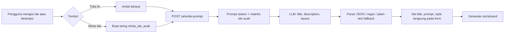
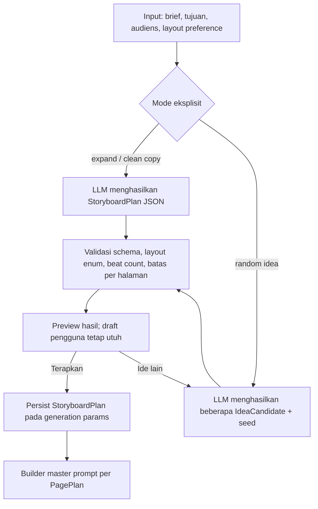

# Audit Fitur **Tulis AI** dan **Minta Ide** — Storymax

**Cakupan:** komponen Generator dan endpoint `POST /ai/write-prompt`.  
**Metode:** penelaahan statis branch `master`; belum ada pengujian runtime terhadap provider LLM atau contoh output pengguna.

## Kesimpulan

**Ya, fitur ini perlu diperbaiki.** Fondasinya sudah baik karena ia menerima brief, memilih layout otomatis/terkunci, dan mencoba menghasilkan judul serta storyboard yang siap dipakai. Namun fitur saat ini terlalu banyak memikul peran sekaligus: membersihkan teks, mengembangkan brief, membuat ide acak, memilih style, serta memaksa deskripsi panel. Kontrak responsnya lemah, sehingga hasil yang lolos parsing belum tentu cocok dengan jumlah halaman/panel yang akan dirender kemudian. [1] [2]

> **Inti masalah:** `Tulis AI` dan `Minta Ide` seharusnya menghasilkan sebuah **rencana cerita terstruktur**, bukan langsung satu string `description` panjang yang dipaksa memuat semua panel lintas halaman.

| Area | Status | Penilaian |
|---|---:|---|
| Penulisan ulang brief menjadi storyboard | Perlu perbaikan | Arah kreatif baik, tetapi format/output belum tervalidasi kuat. |
| Ide acak | Perlu perbaikan tinggi | Menggunakan sentinel string dan hasil langsung menimpa form. |
| Layout otomatis | Cukup | Berjalan, tetapi layout tidak valid diam-diam dialihkan ke default. |
| Konsistensi durasi/panel | Perlu perbaikan P0 | Instruksi memaksa total panel pada satu string, sementara flow render sebenarnya berbasis halaman. |
| Referensi gambar | Perlu perbaikan | Payload `refImage` dikirim tetapi tidak dipakai endpoint. |
| Fallback saat JSON LLM rusak | Perlu perbaikan P0 | Respons teks bebas tetap diterapkan sebagai prompt tanpa validasi struktur panel. |

## Flow Saat Ini



Pada antarmuka, kedua tombol memakai fungsi yang sama. `Tulis AI` mengambil `aiInput`, sedangkan `Minta Ide` menyisipkan prefiks string `minta_ide_acak:` pada concept. Hasil API lalu langsung menjalankan `setTitle`, `setPrompt`, dan `setStyle` tanpa preview atau aksi Apply terpisah. [1]

## Temuan dan Rekomendasi

### P0 — Format description yang diminta tidak cocok dengan flow halaman

Endpoint menghitung `pageCount × gridCount` dan menginstruksikan LLM untuk merinci `Panel 1` sampai total panel terakhir dalam satu `description`. Di sisi lain, batas `description` dipaksa di bawah 1.500 karakter. Pada proyek multi-page atau grid besar, dua aturan ini tidak realistis: setiap panel harus rinci, kronologis, berbeda, tetapi seluruhnya disimpan dalam satu string pendek. Kemudian pipeline storyboard memecah ulang description itu ke halaman, sehingga dua model perencanaan berkompetisi. [2]

| Risiko | Dampak terhadap pengguna | Perbaikan |
|---|---|---|
| Panel terpotong atau diabaikan | Halaman akhir dapat mengulang, menjadi generik, atau kehilangan beat. | Jangan minta semua panel dalam `description` bebas. Return `pages[]` dan `beats[]` sebagai JSON terstruktur. |
| AI writer dan splitter merencanakan hal yang sama | Urutan cerita dapat berubah saat proses generate storyboard. | Persist satu `StoryboardPlan`; splitter hanya digunakan jika plan belum ada. |
| Batas karakter bertentangan dengan kebutuhan detail | LLM mengorbankan konsistensi atau nomor panel. | Terapkan batas per beat/per halaman, bukan satu batas global. |

**Draf kontrak respons yang lebih tepat:**

```json
{
  "version": 1,
  "title": "Kopi Pagi yang Presisi",
  "layout": "recipe_cooking",
  "projectBrief": "Iklan espresso artisan ...",
  "pages": [
    {
      "pageIndex": 0,
      "goal": "Hook dan persiapan",
      "beats": [
        { "index": 0, "action": "...", "camera": "..." },
        { "index": 1, "action": "...", "camera": "..." }
      ]
    }
  ],
  "ideaMetadata": { "mode": "expand" }
}
```

`description` yang sekarang ditampilkan di form dapat dibuat secara deterministik dari `pages[]` agar tetap kompatibel dengan UI lama. Plan terstruktur inilah yang sebaiknya diteruskan ke perbaikan `generationPlan` yang telah didraf sebelumnya.

### P0 — Fallback menerima teks bebas sebagai storyboard valid

Endpoint memiliki tiga tingkat parsing JSON. Bila gagal, ia mengembalikan `content` LLM apa adanya sebagai `description` dan memasang layout default `premium_vertical_row`. Respons bebas itu tidak diverifikasi untuk JSON, panel, layout, batas panjang, atau kesesuaian page count sebelum diterapkan ke form. [3]

> Fallback semestinya menjaga **kontrak yang sama**, bukan hanya mengembalikan string agar tombol tampak berhasil.

**Perbaikan:** validasi response dengan schema. Bila response tidak valid, lakukan satu repair/retry dengan instruksi “kembalikan JSON valid sesuai schema.” Jika tetap gagal, tampilkan pesan yang jujur dan pertahankan isi form pengguna; jangan mengganti layout ke default secara diam-diam.

### P1 — `Minta Ide` memakai sentinel string, bukan mode API yang eksplisit

Mode random idea dideteksi melalui `concept.startsWith('minta_ide_acak')`. Kontrak ini rapuh karena mode produk bercampur dengan isi text pengguna, tidak terversi, dan sulit dilacak pada log/analitik. Mode ini juga memilih niche, estetika, aksi kamera, serta angle secara acak di server tanpa seed atau metadata, sehingga pengguna tidak dapat mengulang ide yang sama atau mengetahui alasan pemilihannya. [2]

**Perbaikan API:**

```json
{
  "mode": "random_idea",
  "brief": "opsional: parfum wanita",
  "layoutPreference": "auto",
  "generation": {
    "videoEngine": "seedance",
    "projectDuration": 30,
    "gridCount": 6,
    "aspectRatio": "9:16"
  },
  "reference": { "hasImage": false }
}
```

Simpan dan return `ideaMetadata` berisi `seed`, `niche`, `aesthetic`, `cameraAction`, dan `creativeAngle`. UI dapat menyediakan **Ide Lain** yang memakai seed baru dan **Pakai Ide Ini** yang menerapkan pilihan pengguna.

### P1 — Hasil langsung menimpa draft pengguna tanpa preview atau undo

Sesudah response diterima, UI langsung menulis judul, description, serta style ke form. Untuk `Minta Ide` ini bisa dapat diterima bila pengguna memang meminta ide baru, tetapi untuk `Tulis AI` atau mode Tokopedia pengguna dapat kehilangan draft yang sedang diedit. Tidak ada preview, riwayat versi, atau undo pada flow ini. [1]

**Perbaikan UX:** tampilkan kandidat hasil dalam panel preview. Sediakan tombol **Terapkan**, **Ganti Ide**, dan **Pertahankan Draft**. Simpan snapshot `title`, `prompt`, dan `style` sebelum Apply agar tersedia Undo sekali klik.

### P1 — Kondisi tombol Tulis AI tidak sama dengan sumber input yang dipakai fungsi

Tombol `Tulis AI` aktif ketika `aiInput` **atau** `prompt` sudah terisi. Namun handler hanya mengambil `conceptText || aiInput.trim()`; jika `aiInput` kosong dan user hanya memiliki `prompt` yang terisi, handler segera `return` tanpa request. Ini menghasilkan tombol aktif yang tampak tidak bekerja. [1]

**Perbaikan minimal:**

```js
const sourceConcept = conceptText || aiInput.trim() || prompt.trim();
if (!sourceConcept) {
  setAiError('Masukkan ide kasar atau deskripsi yang ingin dirapikan.');
  return;
}
```

Untuk mode Tokopedia, beri label yang eksplisit: **Rapikan deskripsi produk** dan gunakan `prompt` sebagai sumber bila kolom ide tambahan kosong.

### P1 — Pilihan layout invalid dialihkan diam-diam ke default

Saat LLM memberikan `layout` yang tidak ada pada `LAYOUT_STYLES`, backend memilih `premium_vertical_row`. Ini membuat hasil terlihat sukses tetapi dapat memakai style yang tidak dimaksud pengguna. [3]

**Perbaikan:** bila `layoutPreference` terkunci, layout harus persis sama. Bila auto, validasi terhadap daftar enum; jika invalid, lakukan repair retry atau return `layout: null` beserta `warnings`, bukan default senyap.

### P2 — Referensi gambar dikirim tetapi tidak digunakan

Frontend mengirim `refImage` lengkap bersama `hasRefImage`, tetapi handler `writePrompt` hanya memakai boolean `hasRefImage`; tidak ada analisis gambar pada endpoint. Untuk gambar base64, ini menambah ukuran request tanpa meningkatkan kualitas hasil. [1] [2]

**Perbaikan:** pilih salah satu dengan eksplisit. Untuk text-only ideation, hapus `refImage` dari request dan hanya gunakan `hasReference`. Jika kualitas ide perlu mengikuti gambar, gunakan vision call yang benar dan simpan `subjectDescriptor` hasilnya—jangan mengirim base64 yang kemudian diabaikan.

### P2 — Prompt sistem terlalu menggabungkan aturan untuk tiga produk berbeda

Satu system prompt menangani pembersihan deskripsi toko, ekspansi ide, storyboard komersial, storyboard non-komersial, pemilihan layout, dan ide acak. Aturan “setia 100% pada ide pengguna” juga berdampingan dengan mandat membuat konsep komersial random. Konteks ini bisa bekerja, namun meningkatkan peluang respons ambigu. [2]

**Perbaikan:** pisahkan template menurut mode:

| Mode | Tujuan | Output |
|---|---|---|
| `expand` | Kembangkan brief pengguna tanpa mengganti intent. | `StoryboardPlan`. |
| `clean_product_copy` | Buang noise toko dan pertahankan fakta produk. | `ProductBrief` + `StoryboardPlan`. |
| `random_idea` | Ciptakan kandidat konsep dari preferensi opsional. | 3 `IdeaCandidate` + metadata seed. |
| `layout_recommendation` | Pilih dan jelaskan satu layout. | `layout`, `reason`, `confidence`. |

## Flow Target yang Direkomendasikan



## Urutan Perbaikan yang Disarankan

| Prioritas | Perbaikan | Nilai langsung |
|---:|---|---|
| **P0** | Ganti output bebas `description` menjadi `StoryboardPlan` ber-schema, lalu validasi sebelum Apply. | Menghentikan panel/halaman yang tidak sinkron sejak awal. |
| **P0** | Hapus fallback sukses berupa teks bebas; gunakan repair retry atau tampilkan error tanpa mengubah form. | Kontrak AI output menjadi dapat dipercaya. |
| **P1** | Ganti sentinel `minta_ide_acak:` dengan `mode: random_idea`, seed, dan metadata. | Ide acak dapat ditelusuri, diulang, dan diganti dengan benar. |
| **P1** | Perbaiki sumber `Tulis AI` dan tambahkan preview/Apply/Undo. | Tombol tidak lagi tampak gagal dan draft pengguna terlindungi. |
| **P1** | Validasi layout untuk mode auto dan locked; jangan default diam-diam. | Mengurangi style salah. |
| **P2** | Hapus `refImage` yang tidak terpakai atau ubah flow menjadi vision-enabled yang nyata. | Request lebih ringan dan perilaku lebih jujur. |
| **P2** | Pisahkan template prompt menurut mode. | Instruksi lebih singkat dan hasil lebih konsisten. |

## Acceptance Criteria

| Skenario | Hasil yang wajib terjadi |
|---|---|
| Tulis AI dengan `aiInput` kosong tetapi textarea prompt berisi | Sistem menggunakan textarea prompt atau menampilkan error yang jelas; tidak diam-diam return. |
| Mode layout terkunci | Respons hanya diterima jika `layout` sama dengan pilihan pengguna. |
| Mode auto-layout | Layout harus enum valid; layout invalid memicu repair/error, bukan default diam-diam. |
| Minta Ide tanpa keyword | Sistem memberi beberapa kandidat ide dengan metadata seed dan tidak menimpa form sebelum Apply. |
| Proyek multi-page | Setiap `PagePlan` memiliki jumlah beat yang sesuai grid halaman, bukan satu string total panel yang dipotong ulang. |
| JSON LLM tidak valid | Sistem mencoba repair sekali; bila masih gagal, draft pengguna tetap utuh. |
| Referensi gambar | Endpoint tidak menerima base64 tanpa memprosesnya; kebijakan text-only atau vision jelas. |

## References

[1]: https://github.com/curls1337/storymax/blob/master/frontend/src/pages/Generator.jsx#L390-L423 "Frontend Tulis AI request and immediate form update"
[2]: https://github.com/curls1337/storymax/blob/master/backend/controllers/aiController.js#L230-L451 "Tulis AI and Minta Ide prompt construction"
[3]: https://github.com/curls1337/storymax/blob/master/backend/controllers/aiController.js#L481-L543 "Tulis AI parser and fallback behavior"
